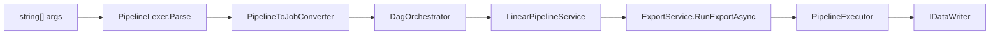

# CLAUDE.md

This file provides guidance to Claude Code (claude.ai/code) when working with code in this repository.

> **Docs map:** end-user CLI/YAML syntax, flag semantics, and recipes live in [README.md](./README.md), [COOKBOOK.md](./COOKBOOK.md), and [REFERENCE.md](./REFERENCE.md) — this file covers internals only (call chains, class ownership, invariants) and links out rather than restating them.

## Language

All code, comments, commit messages, and documentation **must** be written in English. This is a hard requirement — no exceptions.

## Build & Run

Prefer `./build.sh` for a full build (runs unit tests + produces a self-contained binary in `dist/release/`):

```bash
./build.sh
```

For targeted builds during development:

```bash
dotnet build DtPipe.sln
dotnet run --project src/DtPipe -- --help
dtpipe --help
```

## Testing

Prefer `./test_local.sh` for integration tests — it reuses persistent Docker containers instead of spinning up new ones via Testcontainers (much faster):

```bash
./test_local.sh
./test_local.sh --filter "FullyQualifiedName~SomeTest"
```

For unit tests only (no Docker required):

```bash
dotnet test tests/DtPipe.Tests/DtPipe.Tests.csproj --filter "FullyQualifiedName~.Unit."
dotnet test tests/DtPipe.Tests/ --filter "FullyQualifiedName~CliDagParserTests"
```

`test_local.sh` sets `DTPIPE_TEST_REUSE_INFRA=true` to connect to fixed-port containers started by `tests/infra/start_infra.sh`. Use `tests/infra/stop_infra.sh` to tear them down. Shell-based integration scripts are also in `tests/scripts/`.

### Performance Gate

Three tiers, deliberately unequal in where they run:

| Tier | What | Where | Threshold |
|---|---|---|---|
| Micro | `tests/scripts/micro_perf_gate.sh` — BenchmarkDotNet in-process on the hot conversion paths, no infra | CI, every push | Wide (detects a ×2) |
| Macro complete | 15 scenarios incl. Oracle / SQL Server | Local only, `experiments/dtpipe-sandbox` | 15 % |
| Macro light | file↔file + PostgreSQL subset | Optional, nightly, only if micro proves insufficient | Wide |

The complete macro tier stays out of CI for two independent reasons: free runners
cannot host Oracle and SQL Server, and — this one holds regardless — a shared cloud
runner has 20-50 % duration variance, so a 15 % gate there produces random red, not
signal. Same two-level structure the project already uses for tests (CI unit,
`validate_vitals.sh` local).

**A baseline records the machine it was measured on, and the gate refuses to compare
across two different ones** (exit 2, no verdict) rather than render a misleading one.
`--allow-foreign-host` overrides the refusal and clamps the threshold to ≥ 50 %; that
is what the CI job passes, since the committed baseline is from the reference machine.

Update the micro baseline with `./tests/scripts/micro_perf_gate.sh --update` on the
reference machine, and only when a change is a deliberate, understood shift.

### Engine Change Obligations

Any change to `DagOrchestrator` **must** be covered in `DagOrchestratorTests.cs`, and any change to `LinearPipelineService` in `OrderedPipelineTests.cs`. Both validate without the CLI.

Before committing engine changes, verify the three canonical cases:
1. Linear pipeline (single branch, no memory channel)
2. Two-branch DAG (independent branches)
3. DAG with SQL processor (`--from` + `--sql`)

Golden DAG fixtures in `GoldenDagDefinitions.cs` are the canonical shapes. `CliDagParser_GoldenTests.cs` verifies `CliDagParser.Parse(args)` produces them. Add a new topology → add a golden definition + round-trip test in `JobDagDefinition_JsonTests.cs`.

## Architecture Overview

### Solution Structure

| Project | Role |
|---|---|
| `src/DtPipe` | CLI entry point, DI wiring, `JobService`, `ExportService`, MCP server, AI Agent |
| `src/DtPipe.Core` | Abstractions, DAG engine, pipeline models, helpers |
| `src/DtPipe.Adapters` | Readers and writers for all data sources/targets |
| `src/DtPipe.Transformers` | Row and columnar data transformers |
| `src/DtPipe.Processors` | C# side of SQL stream processors (DuckDB, factories) |
| `src/Apache.Arrow.Ado` | Standalone ADO.NET → Arrow library; zero DtPipe deps (depends on `Apache.Arrow.Serialization` only) |
| `src/Apache.Arrow.Serialization` | Standalone CLR↔Arrow type map + POCO serializer; zero DtPipe deps, no external deps beyond `Apache.Arrow` |
| `tests/DtPipe.Tests` | xunit.v3 unit and integration tests |

File placement: `DtPipe.Core` = abstractions/models/engine only. Each transformer in `DtPipe.Transformers` lives in its own subdirectory (`Row/Expand/`, `Arrow/Filter/`…) with matching sub-namespace. Each stream processor in `DtPipe.Processors` follows the same pattern (`DuckDB/`, `Merge/`…). Readers/writers under `DtPipe.Adapters/Adapters/<Name>/`. AI Agent classes under `src/DtPipe/Cli/Agent/`.

### Core Data Flow



`DagOrchestrator` spawns this same chain once per branch, concurrently — even a single-branch (linear) run goes through it once. Fundamental pipeline: `IStreamReader` → `IDataTransformer[]` → `IDataWriter`.

1. `JobService.BuildSubcommands()` registers named subcommands (`inspect`, `providers`, `completion`, `secret`, `mcp`, `agent`) into `System.CommandLine`.
2. `FlagRegistryFactory.Build(serviceProvider)` assembles a `FlagRegistry` from `[ComponentOption]` providers + stream processor trigger flags. `PipelineLexer.Parse(args)` → `ParsedPipeline` (`BranchSpec[]`). `PipelineToJobConverter.Convert(parsed, …)` → `(Dictionary<string, JobDefinition>, JobDagDefinition)`.
3. Linear: `LinearPipelineService` → `ExportService.RunExportAsync()` → `PipelineExecutor`.
4. DAG: `DagOrchestrator` spawns concurrent `Task`s per branch via `Channel<T>` for zero-copy data flow. The kernel is `PipelineExecutor.ExecuteSegmentedPipelineAsync`.

### Provider Pattern

Every adapter implements `IProviderDescriptor<TService>` and is registered in `Program.cs` via `RegisterReader<T>()` / `RegisterWriter<T>()` / `RegisterStreamTransformer<T>()`. `CliProviderFactory<T>` wraps descriptors: `CliOptionBuilder.GenerateFlagDefsForType(OptionsType)` reflects on `[ComponentOption]` → `FlagDef` entries. At execution `FlagBinder.Bind(optionsInstance, args, registry)` maps CLI args to the options object. Provider options live scoped in `OptionsRegistry` (keyed by type).

#### Connection selectors are invisible to providers (non-negotiable)

`ComponentSelector` (`DtPipe.Core.Abstractions`) is the **single authority** on the `{component}[+{variant}]:` grammar. It is the only place allowed to know that prefixes exist.

- **No adapter may test for its own prefix.** `CanHandle` receives the RAW string and must judge by *content* only — file extension (`.duckdb`, `.csv`) or connection-string keywords (`Host=`, `Data Source=`). See the warning on `IDataFactory.CanHandle`. A prefix test there hands the provider a string the router never stripped.
- **Every routing site goes through `ComponentSelector`** — `LinearPipelineService.ResolveFactory`, `InspectCommand`, `DtPipeMcpTools.Analyze` (×3), `PipelineToJobConverter`, `ProviderConfigurationService`, `DagRenderer`. Hand-rolling `StartsWith(ComponentName + ":")` is how the URI rule below ended up fixed in one site and broken in three.
- **A remote URI is never a selector.** The grammar ends in `(?!//)`, so `s3://bucket/key.parquet` is not read as an `s3:` prefix and reaches the provider intact. This is a property of the grammar, not a guard each caller must remember.
- **Variants reach the provider as data, not as text to re-parse.** `ComponentSelector` splits `duck+mysql:Host=…` into variant `mysql` + details `Host=…`; the router puts the variant on `ConnectionRoute.InputVariant`/`OutputVariant`, and `CliProviderFactory` pushes it onto options implementing `IVariantAwareOptions`. The selector owns the *syntax*; which variants are valid stays the provider's business (`DuckHubConnectionParser`) — and as of the native `mysql:` provider its allowlist is empty, so the grammar still parses `duck+mysql:` while the provider rejects it. That split is the point: a retired variant is a provider decision, not a grammar change.

Guarded by `ComponentSelectorTests` and `RemoteUriClaimTests.No_Component_Selector_Strips_A_Remote_Uri` (catalog-wide).

### DAG Pipeline

`PipelineLexer` (`DtPipe.Cli.Pipeline`) tokenises args into `ParsedPipeline` (`BranchSpec` with `ReaderArgs`/`PipelineArgs`/`WriterArgs`). Three tokens trigger an implicit branch split:
- `-i` / `--input` — when an input or job file was already seen in the current branch
- `--from <alias[,alias...]>` — when a `--from`, `--input`, or `--job` was already seen; first `--from` in a fresh branch stays in current branch
- `--job` / `-j <file>` — when a job file or input was already seen

Neither `--sql` nor boolean processor flags (e.g. `--merge`) trigger a split. Each processor declares trigger flags via `IStreamTransformerFactory.CliTriggerFlags`.

Canonical processor grammar (see `REFERENCE.md#dag-syntax` for per-flag semantics, topologies, and examples — not restated here):

```
--from <alias[,alias...]> [--ref <alias[,alias...]>] (--sql "<query>" | --<processor>) [--alias <name>] [-o <dest>]
```

- `--job <file>` / `-j <file>` loads a YAML pipeline job file; `PipelineToJobConverter` reads it and applies any additional CLI flags as overrides.
- `--export-job <file>` serializes the current CLI pipeline to a YAML job file via `JobFileWriter` and exits without running the pipeline.

Branches communicate via `IMemoryChannelRegistry` (`Channel<IReadOnlyList<object?[]>>` or Arrow `Channel<RecordBatch>`). Fan-out (broadcast/tee) is resolved via `BranchChannelContext.AliasMap` (logical alias → physical channel including `s__fan_0` sub-channels), populated by `DagOrchestrator` and consumed directly by factories (e.g. `DuckDBSqlTransformerFactory.cs:71`).

> `--ref` is intentionally materialized (cost-based query planning) — rationale and per-flag semantics: `REFERENCE.md#dag-syntax`.

### SQL Processors

`CompositeSqlTransformerFactory` is the DI entry point for `--sql` branches. The default (and currently only) engine is DuckDB — `DuckDBSqlTransformerFactory` / `DuckDBSqlProcessor`: zero-copy Arrow C Data Interface on read (`--from`), lazy streaming fetch (`duckdb_execute_prepared_streaming` + `duckdb_fetch_chunk`) on write, schema inferred from the prepared statement before execution. `DuckHubConnectionParser` parses `duck+{provider}:` connection strings and auto-issues `INSTALL`/`LOAD`/`ATTACH`. `--retry` uses Polly v8 (`DatabaseRetryPolicy`). `--duck-init`/`--compute`/`--expand` value resolution goes through `IStringContentResolver` (`CliStringContentResolver` for the CLI, `DefaultStringContentResolver` for headless contexts). The init-SQL runner is duplicated verbatim between `DuckInitSqlHelper` (Adapters) and a private `RunInitSqlAsync` (Processors) — Processors can't reference Adapters, so don't add a third copy; if consolidating, promote it to a neutral shared location instead. User-facing flag syntax and examples: `REFERENCE.md#provider-specific-options`, `COOKBOOK.md#sql-processors-and-joins`.

### Transformer Pipeline

`IDataTransformer` has `InitializeAsync` (schema), `Transform` (per-row), `Flush` (end-of-stream). `PipelineSegmenter` groups consecutive columnar-capable transformers into segments for Arrow zero-copy bridging between row and columnar modes.

### Key Interfaces

- `IStreamReader` / `IColumnarStreamReader` — open + stream batches
- `IDataWriter` / `IRowDataWriter` / `IColumnarDataWriter` — write contracts
- `IDataTransformer` / `IDataTransformerFactory` — row transforms
- `IStreamTransformerFactory` — multi-input processors; `Create(branchArgs, ctx, serviceProvider)` receives `BranchChannelContext` for alias resolution
- `ICliContributor` / `OptionsRegistry` — CLI contribution + scoped option store

## Debug Mode

```bash
DEBUG=1 dtpipe --input pg:"..." --output csv:out.csv
```
Verbose branch-level logging to stderr.

## Exit Codes

`0` = success · `1` = fault · `130` = user cancellation (Ctrl-C, POSIX SIGINT convention).

Cancellation never masks as success (F16): `LinearPipelineService` discriminates the dedicated user token from internal cancellation sources and returns 130 on user shutdown; internal cancellation propagates. In DAG runs, a branch reporting 130 makes `DagOrchestrator` cancel the rest and return 130. The only intentional cancellation-swallowing site is `DagOrchestrator.ExecuteBranchAsync`'s orphaned-producer path (returning 0 is normal fan-out operation when consumers complete).

## Pipeline Design Principles

### No magic conversions in the engine core

The engine (Core, Processors, DAG orchestrator) must **never** perform implicit type conversions to work around an adapter limitation. Adapter-specific behavior belongs in the adapter.

When a type mismatch arises (e.g. CSV `string` UUID vs Parquet `FixedSizeBinary(16)` UUID), prefer in order:
1. **Adapter parameterization** — e.g. `--column-type "Id:uuid"` on CSV reader
2. **Pipeline transformer** — e.g. `--compute` to parse the string column
3. **SQL processor** — e.g. `CAST(base64_decode(id) AS UUID)` in `--sql`

Forbidden:
- Detecting a source format and silently converting in a type mapper/schema factory
- Changing `ArrowTypeMapper` / `PipeColumnInfo` to compensate for an adapter
- Branching in `ExportService`/`PipelineExecutor`/`DagOrchestrator` on adapter identity

Canonical UUID: `FixedSizeBinaryType(16)` + Field metadata `ARROW:extension:name = arrow.uuid`, RFC 4122 big-endian (`ArrowTypeMapper.ToArrowUuidBytes` / `FromArrowUuidBytes`).

## Apache.Arrow.Serialization

Standalone library with no DtPipe deps (only `Apache.Arrow`):

```
Apache.Arrow.Serialization ← standalone
       ↑ 
Apache.Arrow.Ado          ← uses ArrowTypeResult
       ↑
DtPipe.Core               ← ArrowTypeMapper is facade over ArrowTypeMap
```

`ArrowTypeMap` (`Mapping/ArrowTypeMap.cs`) is the canonical CLR↔Arrow map; `ArrowTypeMapper` in Core is a facade. `FixedSizeBinaryArrayBuilder` lives only in `Apache.Arrow.Serialization/Reflection/FixedSizeBinaryArrayBuilder.cs` — Core consumes it via project reference (single definition). See `EXTENDING.md` for `ArrowSerializer`/`ArrowDeserializer` usage.

## Adding a New Adapter

See `EXTENDING.md` for full patterns. Key rules:
- **Row writers**: build `ColumnConverterFactory.Build(sourceClrType, targetClrType)` once per column at init; never per-cell `ValueConverter.ConvertValue()`.
- **Columnar writers**: implement `IColumnarDataWriter`; use `ArrowTypeMapper.GetValueForField(array, field, i)` when a `Field` is available.
- **Text readers**: implement `IColumnTypeInferenceCapable` for `--auto-column-types`.

### Arrow ↔ CLR mapping: no heuristics

`ArrowTypeMapper.GetClrType(IArrowType)` never infers semantic type from storage alone (`FixedSizeBinary` → `byte[]`). Use `GetClrTypeFromField(Field)` (checks extension metadata).

Key APIs:
- `GetLogicalType(Type)` → `ArrowTypeResult` (`.ArrowType` + `.Metadata`)
- `GetField(name, clrType, nullable)` → `Field` with metadata — use instead of `new Field(...)`
- `GetClrTypeFromField(Field)` / `GetValueForField(array, field, i)` — metadata-aware (e.g. `arrow.uuid` → `Guid`)
- `GetClrType(IArrowType)` / `GetValue(array, i)` — storage-only

## MCP Server & Agentic Integration

`dtpipe mcp` (STDIO) exposes schema-discovery, validation, and execution tools for AI assistants (`execute-yaml-job` is dry-run by default). Don't enumerate tool names here — see `REFERENCE.md#mcp-server` (canonical, up-to-date tool table) and `REFERENCE.md#agent-guardrails` for full options. `dtpipe agent` runs an interactive loop with Ollama/OpenAI (`AgentExecutor`, `AgentTui`, `OllamaClient`).

Hardening invariants (F1–F7, fail-closed, non-negotiable — details in `REFERENCE.md#agent-guardrails`):
- **F1 Planner/Executor split** — `--mode plan` (default) hides `execute-yaml-job` from the model.
- **F2 Guardrails** — `ISqlSafetyPolicy` (destructive verbs / network) + `IApprovalGate`; `apply` + approval + clean check required for writes.
- **F3 Determinism** — `temperature 0 + seed` and `--repeat N`; `DeterminismReport` variance = distinct-YAML − 1.
- **F4 Non-destructive context** — fact cache + `ConversationWindowManager.Compact`.
- **F5 Parallel tools** — all `ToolCalls` per turn executed (`Task.WhenAll`; `--sequential` forces serial).
- **F6 Single YAML path** — `yamlContent` tool arg is sole plan source.
- **F7 CI gate** — `tests/agentic/analyze-traces.sh --gate` fails on unhandled MCP errors or a failed mission. Its variance criterion applies only when `variance_results.jsonl` holds real replication data; the shipped missions drive their own bash ReAct loop against `dtpipe mcp` and never invoke `dtpipe agent --repeat`, so they produce none. Never record a placeholder variance to fill the file — a criterion that cannot fire is worse than an absent one. The authoritative signal for F1–F7 is the deterministic unit suite (`Unit/Cli/Agent*Tests`, `Unit/Cli/Mcp*Tests`), not this gate.

Mandatory MCP directives:
1. No hardcoded help — reflect on `[Description]`/`[ComponentHelp]`.
2. In-memory execution via `JobFileParser` + `JobService.ExecutePipelineAsync()` — no temp files/shell proxies.
3. Auto table discovery on `inspect` without a query, plus actionable hints on validation errors.
4. Fail-closed — default `apply=false`, reject on ambiguity.
